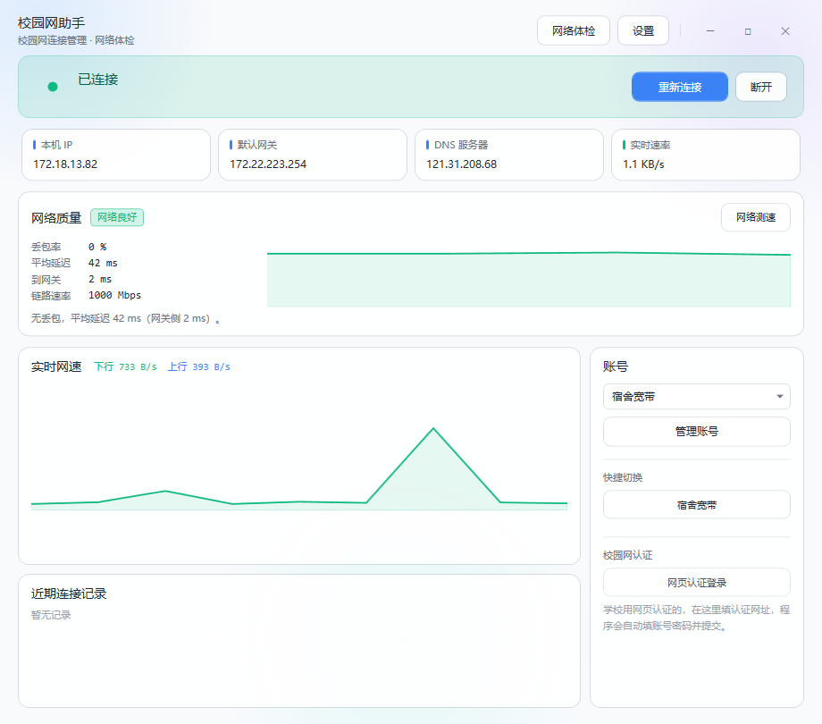
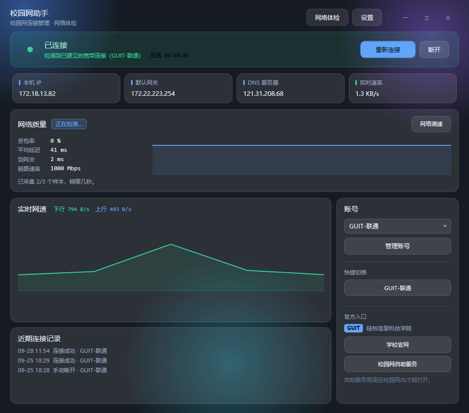
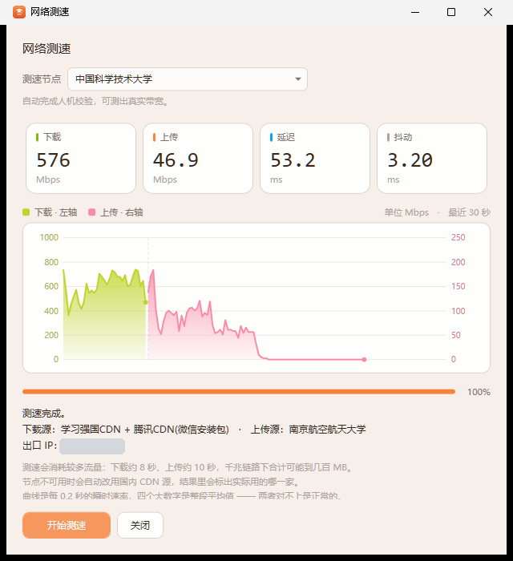

# 校园网助手 · CampusNetHelper

一个轻量的 Windows 校园网连接管理工具。把「填账号 → 拨号 → 断线重连 → 排查问题 → 测速」这几件每天都要做的事，收进一个小窗口里。

**绿色免安装，单文件，双击就能用。** 不写注册表、不装驱动、不留后台服务。



<details>
<summary>深色主题（截图）</summary>



</details>

界面跟随 Windows 的浅色 / 深色设置自动切换。绿色表示已连接，灰色表示没连，橙色表示正在连，红色表示出错了 —— 扫一眼就知道什么情况。

---

## 下载

### 👉 [前往 Releases 下载最新版](https://github.com/khssdsg-maker/campus-net-helper/releases/latest)

> 🇨🇳 **国内访问 GitHub 有困难？** 用 Gitee 镜像：
> 👉 [gitee.com/khssdsg/campus-net-helper/releases](https://gitee.com/khssdsg/campus-net-helper/releases)
> 两个仓库内容完全一致，挑一个能打开的下载就行。

有两种下法，随便挑：

| 下哪个 | 怎么用 |
| :-- | :-- |
| **`CampusNetHelper_v2.0.0.exe`** | 下载后**直接双击**。不用解压、不用安装 —— 最省事 |
| `CampusNetHelper_v2.0.0.zip` | 解压得到 `校园网助手.exe` + `使用说明.txt`，双击 exe 即可 |

两个文件里的程序**完全一样**，压缩包只是多带了一份 `使用说明.txt`。

**第一次怎么用（三步）**

1. 先用**学校官方的上网客户端**连一次网 —— 目的：让 Windows 记住你的宽带账号
2. 双击运行本程序 → 点右侧「**管理账号**」→ 从下拉框选你的连接 → 点「**导入**」→「**保存**」
3. 回到主界面，点「**立即连接**」

以后再用：双击 → 点「立即连接」。

> ⚠️ **Windows 可能弹出「已保护你的电脑」** —— 本项目没有购买数字签名，小众软件常被误报。
> 点「更多信息」→「仍要运行」即可。杀毒软件也可能误报，添加信任。

---

## v2.0.0 更新了什么

这一版主要围绕**网页认证模式**（学校不发宽带账号、而是弹网页让你登录的那种）做了大幅补齐。

**新增**

- **认证掉线自动恢复。** 以前网页认证模式下断了就断了，得自己重新点认证页登录。
  现在会自动重开认证页、把账号密码填好，你只填验证码。
  后台或全屏玩游戏时**只发托盘气泡、不弹窗打断**，点一下气泡才开。
- **多个认证入口。** 宿舍 / 教学楼 / 图书馆认证地址不一样，可以存成一个列表下拉切换。
  同一入口的不同写法（`10.6.6.6` 与 `http://10.6.6.6/login`）自动归成一条，不会重复堆。
- **认证模式的网络信息齐全了。** 主页现在会显示「已认证上网」、在线时长、
  实时上下行速率曲线 —— 以前认证模式下这几块都是空的。

**修复**

- 网页认证模式下**网速曲线一直是 0**（拿拨号的判据去量认证模式，压根没有拨号网卡）。
- 网页认证模式下**主页不显示任何网络信息**（同一个原因）。
- **在线时长「盯着它就不动」**：呼出主窗口时数字停住，切到后台才跳。
  根因是拖动窗口会让 Windows 的消息循环挡住计时器。
- 字段档案里**打字时输入框会跑掉**（焦点被抢）。
- 日志被重复信息淹没：心跳成功、认证页重试各占了全天日志的 28% / 27%。现在只在
  状态真正变化时才记。

---

## 它解决什么问题

Windows 自带的宽带拨号能用，但不好用：藏在「网络和共享中心」深处，断了不会自己接回来，出了问题也说不出坏在哪一环。

这个工具就是把这几件事做好：

| 功能 | 说明 |
| :-- | :-- |
| 一键拨号 | 点一下就连接，不用再翻系统菜单 |
| 断线自动重连 | 网络掉了自动重拨，间隔可调（默认 30 秒）。**拨号和网页认证两种模式都支持** |
| 网络体检 | 8 项检查逐条给结论：网卡 / IP / 网关 / DNS / 外网 / 延迟 / 拨号 / 系统环境 |
| **连接质量监测** | 丢包率、平均延迟、到网关延迟、链路速率 + 延迟曲线，并直接告诉你是**哪一段**出了问题 |
| **网络测速** | 下载 / 上传 / 延迟 / 抖动 + **实时波形图**（能看出掉速、抖动、中途被抢带宽），内置两个高校测速节点 |
| **夜间免打扰** | 设一个时间段（可跨零点），期间不检测、不重连、不弹提示；宿舍夜里断电断网时最省心 |
| **心跳保活** | 联网期间定期发一个极小请求，避免学校按「空闲 N 分钟」把连接踢掉 |
| **网页认证登录** | 学校用网页认证（而不是拨号）时：填上你学校的认证网址，程序自动填账号密码并提交（有图形验证码时只填不提交，验证码留给你） |
| **多个认证入口** | 宿舍、教学楼、图书馆的认证地址不一样？存成一个列表，下拉切换。同一入口的不同写法自动归一条 |
| **认证掉线自动恢复**（v2.0.0） | 网页认证掉线后自动重开认证页并填好账号密码，你只填验证码。**后台/游戏场景只发托盘气泡，绝不弹窗打断** |
| 实时网速 | 主界面显示上下行速率曲线（拨号、网页认证都算得准） |
| 连接记录 | 记下每次连接成功和失败，方便回溯「什么时候断的」 |
| 多账号管理 | 可存多个账号，一键切换；能从系统已有连接导入 |
| 托盘常驻 | 关掉窗口后待在右下角托盘，继续守护网络 |
| 诊断包导出 | 一键打包体检报告和日志到桌面，方便求助（**不含密码**） |

---

## 网络质量怎么读

这是这个工具比较有价值的一块：**它不只报数字，还会告诉你问题在哪一段。**

| 现象 | 结论 | 说明 |
| :-- | :-- | :-- |
| 到网关就丢包 | 本地线路不稳定 | 问题在「电脑 → 交换机」这一段，先查网线 / 换网口 |
| 网关正常、外网丢包 | 出口方向有丢包 | 问题在学校出口，不是你的电脑 |
| 网关正常、外网全丢 | 外网探测无响应 | 更可能是对方禁了 ICMP，**不能认定出口故障** |

最后一行是刻意做成 fail-open 的：宁可说「可能被限制」，也不误报成「学校网络坏了」。

---

## 网络测速

点「网络测速」→ 选节点 → 开始，几秒钟出四个数：**下载 / 上传 / 延迟 / 抖动**。

内置节点：

| 节点 | 状态 |
| :-- | :-- |
| 中国科学技术大学 `test.ustc.edu.cn` | ✅ 可用 |
| 南京大学 `test.nju.edu.cn` | ✅ 可用 |
| 南京航空航天大学 `speed.nuaa.edu.cn` | ⚠️ 后端未运行，仅用作上传端点 |

> 中科大和南大在测速前会下发人机校验（工作量证明 / Anubis 反爬），程序会自动完成这一步 —— 也就是浏览器打开这两个站点时会自动做的事。

**几个实测出来的结论**（都写在代码注释里了）：

- 单条 TCP 连接的吞吐上限 ≈ 接收窗口 ÷ 往返延迟，所以测速**必须多连接并发**，否则会低估几十倍
- 下载只使用国内大厂 CDN 上的公开安装包做源，**不是源越多越好** —— 混进慢源会把总吞吐拖下来 38%
- 上传端点会返回 4xx（正常，数据确实发出去了），**4xx 不算失败**，只有连接层异常才算
- 到中科大往返约 80ms，单连接实测只有 4 Mbps，而 16 条并发能跑 700 Mbps 以上

> ⚠️ **测速前请先关掉代理 / 加速器。** Clash 一类工具按进程分流时，程序测的是代理出口而不是校园网出口，结果会差好几倍。测速窗口里会显示当前**出口 IP**，可以直接看出来有没有被代理接管。

### 实时波形图（v1.3.0 新增）

测的过程中会实时画出上行 / 下行的瞬时速率（每 0.2 秒一个点）：



四个数字只是**整段的平均值**，中途掉速、被人抢带宽、抖动厉害这些事它说不出来 —— 波形能：

- **青色**是下载，看**左轴**；**紫色**是上传，看**右轴**
- 两条曲线各配一条纵轴：宿舍网下载常常是上传的十倍，共用一条轴的话上传那条会一直贴在地板上，起伏全看不见
- 下载和上传是分两段测的，中间那条竖虚线就是分界
- 横轴固定 30 秒窗口，所以曲线是「从左往右长」，不会因为数据变多而横向挤压

> 为了不让假数据污染量程，每个阶段开头 1 秒（建连、填缓冲区、TCP 慢启动）的采样不画；
> 阶段末尾那半拍数据也是残缺的，所以采样特意「慢一拍」发布，最后那个假低谷不会被画出来。

---

## 系统要求

- Windows 7 / 8 / 10 / 11（32 位或 64 位都可以）
- .NET Framework 4.0 或更高（Windows 8 以上系统自带，无需额外安装）
- 一张有线网卡（本工具针对**网线拨号**场景）
- 圆角窗口效果只在 Windows 11 上生效，Windows 7 / 10 上是方角，功能一样

---

## 使用方法

### 第一步：添加账号

1. 双击运行程序
2. 点右侧「**管理账号**」
3. 填写三项：**连接名称**（随便起）、**宽带账号**、**上网密码**
4. 点「保存」

> **不知道宽带账号是什么？**
>
> 宽带账号是学校或运营商发给你的上网凭证，和学号、校园门户密码不是一回事。
>
> 如果电脑上已经用**学校提供的上网客户端**连接过网络，那个连接名会出现在「管理账号」页的「**从系统已有连接导入**」下拉框里，直接选它导入即可 —— 账号和密码会自动带出来。
>
> 本工具**不做任何账号查询**，只是帮你把账号填进 Windows 的宽带连接里。

### 第二步：连接

在主界面点「**立即连接**」。连上后顶部横条变绿色，显示「已连接」和在线时长。

### 第三步：让它自己守着（可选）

点右上角「**设置**」：

- 勾上「**断线后自动重连**」
- 勾上「**开机自动启动**」

这样开机就会自己连上，断了也会自己重拨。关窗口只是收进托盘，想彻底退出请右键托盘图标选「退出程序」。

### 第四步（可选）：学校用的是网页认证？

有些学校的校园网不是拨号，而是打开一个网页填账号密码。这种情况用「**网页认证登录**」：

1. 主界面右侧「校园网认证」→ 点「**网页认证登录**」
2. 把**你们学校的认证网页地址**填进去（问同学、看学校通知，或看连不上时浏览器自动跳转到的那个页面）
3. 程序会把保存好的账号密码**自动填进去并提交** —— 下次打开直接就是登录状态

> 地址会记在本机，下次不用再填。
> 如果程序认不出页面上的登录框，它会**明确告诉你**，不会瞎点；这时点「用系统浏览器打开」手动登录也一样。
> 因为要保住「绿色单文件」，内嵌浏览器用的是系统自带的 IE 内核 —— 老式表单页没问题，
> 用现代前端框架写的认证页可能白屏，那就用「用系统浏览器打开」兜底。

---

## 网络不通？先体检

点右上角「**网络体检**」，它会按顺序检查 8 项，每项都告诉你**正常还是异常**，异常还会说**可能是什么原因**：

| 检查项 | 能发现的问题 |
| :-- | :-- |
| 有线网卡状态 | 网线没插好 / 网口没信号 / 网卡驱动异常 |
| IP 地址配置 | 没拿到 IP / 拿到 169.254 开头的无效地址 |
| 默认网关 | 本地这一段网络不通 |
| DNS 域名解析 | 能连但打不开网页 |
| 外网连通性 | 还没拨号 / 认证没过 |
| 网络延迟 | 网络质量差、游戏会卡 |
| 宽带拨号状态 | 拨号是否真的建立 |
| 系统与网卡清单 | 环境快照，方便对比 |

搞不定就点「**导出诊断包**」，会在桌面生成一个压缩包。**这个包里不含密码**，可以直接发给懂电脑的同学或老师帮忙看。

---

## 拨号失败错误码速查

| 错误码 | 含义 | 怎么办 |
| :-- | :-- | :-- |
| **691** | 账号密码错误，或账号已在别处登录 | 核对账号密码；如果手机 / 路由器上也拨过，先退出那边 |
| 678 / 680 | 无拨号音，远程无响应 | 检查网线是否插好、网口是否有信号 |
| 629 / 651 | 连接被终止 / 网卡无响应 | 禁用再启用有线网卡，然后重试 |
| 718 | 等待对方应答超时 | 服务器忙，等几分钟再试 |
| 769 | 目标不可达 | 本机地址配置异常，重启网卡 |
| 814 | 未找到宽带网络设备 | 检查设备管理器里的网卡驱动 |

> 如果提示**拨号过于频繁**，不要连续重试 —— **静置 10 分钟**再拨，越试等待时间越长。
> 连续重试这类错误码还可能触发运营商 / 学校的限速策略。

---

## 关于隐私

这个工具做的事情**很少**，而且都在你自己电脑上：

- 使用 Windows 系统自带的 PPPoE 拨号功能（和「网络和共享中心」里手动建连接完全一样）
- 账号密码保存在本机 `%AppData%\CampusNetHelper\`，**密码用 Windows DPAPI 加密**（只有本机本账户能解开），**也不外传**
- 不连接任何第三方服务器，不采集、不上传任何使用数据
- 测速时只会向公开的测速站点和国内大厂 CDN 发起常规 HTTP 请求
- 心跳保活只请求一个公开的、**响应体为空**的网络探针地址，不带任何数据
- **不做任何账号查询，也不调用任何学校后台接口**

**关于「网页认证登录」**：这个功能是把学校**自己公开的登录网页**内嵌进程序，
由程序替你完成「填账号密码 → 点登录」这个动作 —— 和你用浏览器登录是**同一件事**，
只是省了手动输入。它不解析、不逆向、不调用学校的任何后台接口，
认证过程完全由学校网页自己的代码完成。认证网址由你自己填写，程序只负责记住它。

如果不希望在本机留下密码，保存账号时可以不填密码，每次拨号时手动输入。

---

## 从源码构建

需要 .NET Framework 4.x 自带的编译器（`csc.exe`），**无需安装 Visual Studio**。

```bat
build_check.bat
```

双击即可编译，产物输出到 `dist\CampusNetHelper.exe`。

### 本校专属默认值

这个项目刻意保持**通用** —— 源码里不放任何学校的具体信息（校徽、校名、学校官网、校内地址都不在）。

但你自己用的时候，会希望默认值已经填好（比如网页认证的网址），不用每次手输。所以：

- 仓库里只有空模板 `SiteConfig.sample.cs`
- 首次构建时，`build_check.bat` 会自动把它复制成 `SiteConfig.cs`
- `SiteConfig.cs` 已被 `.gitignore` 排除 —— 你自己的学校信息不会进版本库

想预设自己学校的认证网址：编辑 `SiteConfig.cs` 里的 `DefaultWebAuthUrl`，重新编译即可。
**留空则由使用者自己在界面上填**（公开仓库构建出来的就是这个状态）。

> 注意：编译出来的 exe 里**必然**带着这个地址，否则功能没法用 —— 「源码不公开」不等于「exe 里没有」。

### 构建约束

源码使用 **C# 5 语法**（兼容系统自带的旧版编译器），请勿使用以下 C# 6+ 特性：

- 字符串插值 `$"..."`
- 空条件运算符 `?.`
- `nameof`、表达式体成员 `=>`、`out var`

另外：`.cs` 请保存为 **UTF-8 with BOM + CRLF**，`.bat` 必须**纯 ASCII + CRLF**。

---

## 目录结构

```
campus-net-helper/
├── App.xaml.cs            程序入口、单实例保护、静默启动
├── Theme.cs               主题系统（浅色 / 深色，跟随系统）
├── MainWindow.cs          主界面布局与控件工厂
├── MainWindow.Logic.cs    主界面业务逻辑（拨号 / 网速 / 质量刷新 / 托盘）
├── HealthWindow.cs        网络体检窗口
├── SettingsWindow.cs      设置窗口
├── AccountWindow.cs       账号管理窗口
├── SpeedTestWindow.cs     网络测速窗口
├── WebAuthWindow.cs       网页认证窗口（内嵌 IE 内核，自动填表登录）
├── DialEngine.cs          拨号引擎（PPPoE、电话簿、17 条错误码词典）
├── QualityMonitor.cs      连接质量监测（后台线程 ping 网关 + 外网）
├── KeepAlive.cs           心跳保活（防学校「空闲下线」）
├── SpeedTestEngine.cs     测速引擎（延迟 / 并发下载 / 并发上传，多源降级）
├── SpeedChart.cs          测速实时波形图（自绘控件，无 XAML、无第三方库）
├── PowGate.cs             测速站的人机校验（工作量证明 / Anubis）
├── HealthReport.cs        8 项网络体检、诊断包导出
├── ConfigStore.cs         账号与设置存储
├── AutostartHelper.cs     开机自启（计划任务）
├── Logger.cs              滚动日志（7 天自动清理）
├── HealthCheckStep.cs     体检结果数据结构
├── SiteConfig.sample.cs   本校默认值模板（空；真实值在 SiteConfig.cs，不入库）
├── assets/                图标（logo.ico / logo.png）
├── docs/                  README 用的界面截图
└── build_check.bat        一键编译脚本
```

---

## 常见问题

**Q：为什么连不上，提示 691？**
A：三种可能。① 账号或密码输错了（注意：是**上网账号**，不是学号或校园门户账号）；② 这个账号正在别的设备上使用，先退出那边；③ 拨号太频繁，等 10 分钟。

**Q：手机连 WiFi 能上网吗？**
A：本工具只管**电脑用网线拨号**这一件事，不涉及手机。如果需要手机共享电脑网络，请用 Windows 自带的「移动热点」功能。

**Q：换了电脑或重装系统，账号还在吗？**
A：不在了。账号存在本机用户目录，换电脑需要重新填写。

**Q：我用的是「网页认证」而不是拨号，能用吗？**
A：本工具针对的是**需要用宽带账号密码 PPPoE 拨号**的场景。如果你的校园网是打开浏览器弹出登录页认证的，那种情况不需要拨号。

**Q：测速的数字，跟我用手机 / 别的软件测出来不一样？**
A：正常。节点不一样、时间不一样、有没有走代理，结果差很多。看趋势就行，想比就固定用同一个节点、连续测几次。

**Q：界面是深色的，能改成浅色吗？**
A：界面默认跟随 Windows 设置。打开「设置 → 个性化 → 颜色」，把「选择默认应用模式」改成「浅色」即可；也可以在程序自己的「设置」里指定浅色 / 深色。

**Q：程序关掉后还会自动重连吗？**
A：只要勾选了「关闭窗口时最小化到托盘」，关窗口只是收进托盘，程序还在后台运行，会自动重连。想彻底退出请右键托盘图标选「退出程序」。

**Q：杀毒软件报警了？**
A：正常现象 —— 本项目**没有购买数字签名**，小众软件常被误报。添加信任即可。

---

## 已知限制

- **不做账号解析** —— 需要先用学校客户端连一次，或手动填账号
- **只针对有线 PPPoE 拨号** —— 不涉及无线、网页认证、802.1X
- **网速只统计拨号接口** —— 未连接时显示 0（避免混入 Wi-Fi / 局域网流量）
- **主题切换后子窗口不立即刷新** —— 需重新打开
- **测速依赖第三方站点的可用性** —— 节点随时可能下线或加新的反爬
- **未做代码签名** —— 杀毒软件可能误报

---

## 免责声明

- 本项目是**个人学习与技术实践作品**，与任何学校、运营商均无隶属或合作关系，也未获得其授权或认可。
- 本项目**不提供、不绕过、不破解**任何学校网络认证；它调用的是 Windows 自带的 PPPoE 拨号功能，与用户在「网络和共享中心」里手动拨号是同一件事。
- 「网页认证登录」只是**自动化了浏览器里的一次表单填写与提交**，等价于用户手动登录，不改变认证流程本身，也不替用户取得任何额外权限。
- 使用本项目**不改变**用户与学校 / 运营商之间的任何约定，用户仍需自行遵守所在网络的使用规定。
- 软件按「现状」提供，不附带任何明示或暗示的担保。因使用本软件产生的任何后果，由使用者自行承担。

---

## 许可

MIT License，详见 [LICENSE](LICENSE)。

你可以自由使用、修改、分发这个工具。
